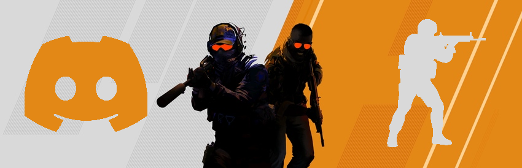
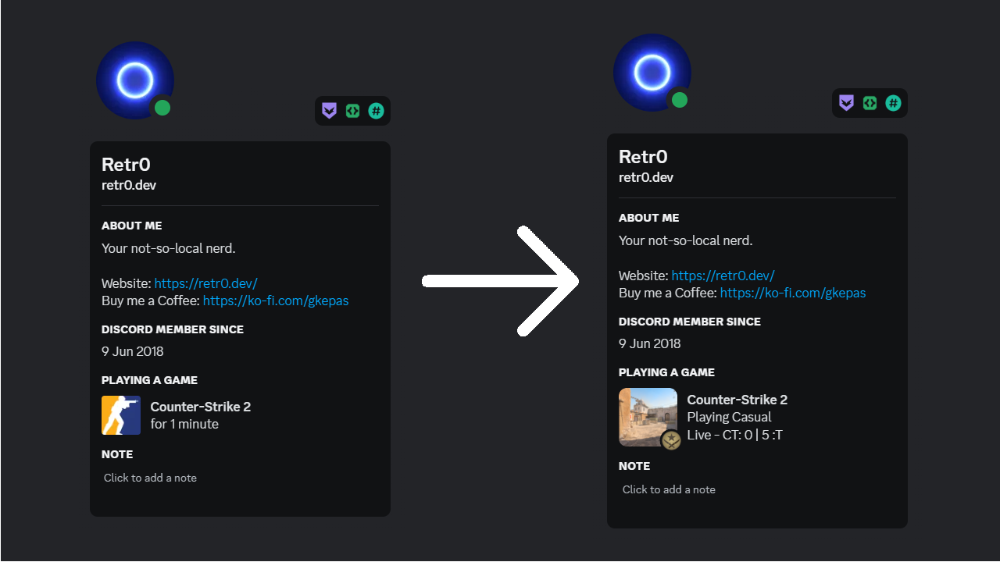

  

# CS2 Discord Rich Presence  

  
A Rich Presence application for showing custom status of your active Counter-Strike:Global Offensive game.

- [CS2 Discord Rich Presence](#cs2-discord-rich-presence)
	- [How It Works](#how-it-works)
	- [Showcase](#showcase)
	- [Install](#install)
	- [Troubleshooting](#troubleshooting)
	- [Credits](#credits)
	- [Licensing](#licensing)

## How It Works
This application uses the [Counter-Strike Game State Integration](https://developer.valvesoftware.com/wiki/Counter-Strike:_Global_Offensive_Game_State_Integration) to fetch the data of your active game. It creates a local server (port 3000) which listens for the data and then applies it to your Discord client.

## Showcase

  

## Install
Go to the [latest release](https://github.com/Retr0-01/CSGO-Discord-RP/releases/latest), download the ``CS2-Discord-RP.zip`` file from the Assets section and then extract it to the location of your choosing. Now you should have the exe and a file called ``gamestate_integration_discord-rp.cfg``.  
All you have to do now is run the exe and you should be good to go!

## Troubleshooting
**[SETUP] CS2 installation path not found! Aborting...** 
> If for whatever reason the application couldn't find your game installation path or write the config file needed, you need to manually copy the ``gamestate_integration_discord-rp.cfg`` file and paste it *inside* the ``cfg`` folder of your CS2 installation.  
> Example path: `C:\Program Files (x86)\Steam\steamapps\common\Counter-Strike Global Offensive\game\csgo\cfg`
> 
## Credits
Huge thanks to the following devs/teams for creating some of the packages/tools used.  
- [Newtonsoft](https://www.newtonsoft.com/json) for Json.NET
- [Lachee](https://github.com/Lachee/discord-rpc-csharp) for the C# implementation of the Discord RPC
- [quicktype](https://quicktype.io/csharp) for instantly generating the needed C# models in order to use the JSON data

## Licensing  
This repository is licensed under the MIT License. [Learn more.](https://github.com/Retr0-01/CSGO-Discord-RP/blob/main/LICENSE.md)
